# __Project Resonator | *The* Open-Source IEM.__  
> A love letter to the IEM/CIEM hobby.

## Technologies Used & Software Required

1. **VituixCAD**             — Tuning simulation (see install guide below)  
2. **KiCad**                 — Schematic and PCB design  
3. **Autodesk Fusion**       — Designing the IEM shell  
4. **FPGraphTracer**         — Tracking frequency and impedance responses from driver spec sheets  

[Youtube Playlist For Addional IEM Building Resources](https://youtube.com/playlist?list=PL4ahDGGN5zBFhmGqVUoBdOnjuF_9HXV5L&si=1wQDmEUnnXoC1L7I)

## Development Timeline

- [x] Moved crossover simulation to the latest VituixCAD (old version archived under `/legacy`) | Crossover  
- [x] Updated driver setup to CI22955 + BK23824 + 2× SWFK 31736 | Drivers  
- [x] Removed PCB requirement in favor of direct SMD soldering (PCB file kept for reference) | Assembly  
- [x] Removed outdated SMD components list (will add new sourcing guide soon) | Documentation  
- [X] First physical prototype in progress thanks to preliminary funding | Prototyping

- [+] [Modular, Node-based Tuning Software](https://github.com/DriftingOtter/EarCanvas)     | Software

- [x] Tools & Software                        | Wiki Entry  
- [x] Driver Selection                        | Wiki Entry  
- [+] Crossover Design                        | Wiki Entry  

...  
_More to come._

## Philosophy & Reasoning

> I fell in love with IEMs, so I decided "why not, I'm bored."

## Can I Use These Files To Build My Own IEM?

Absolutely. I’ve set the license to be lenient for anyone who wants to use this as a base for their own commercial projects—while still keeping that open-source spirit that I’ve grown to love in the comp sci world.

I hope this gives you a head start—maybe even helps you dodge some of the mistakes I made.

*Reminder: I’m still human, and this design is far from perfect—but it should give you a solid look at what an IEM build process can look like.*

## Project Resonator 4 Way Passive Crossover Diagram [For 4BA Driver Configuration]

```mermaid
graph LR
    Input[Source Input] --> Woofer_Path[Woofer Path<br/>CI-22955]
    Input --> Mid_Path[Mid Path<br/>BK-26824]
    Input --> High_Path[High Path<br/>SWFK-31736]
    
    Woofer_Path --> R1[22Ω Series]
    R1 --> C1[4.7µF Parallel]
    C1 --> Woofer[CI-22955<br/>Woofer]
    C1 --> GND1[GND]
    
    Mid_Path --> C2[10µF Series]
    C2 --> R2[22Ω Series]
    R2 --> C3[4.7µF Parallel]
    C3 --> Mids[BK-26824<br/>Mids]
    C3 --> GND2[GND]
    
    High_Path --> T1_Path[Tweeter 1 Path<br/>Damped]
    High_Path --> T2_Path[Tweeter 2 Path<br/>Light]
    
    T1_Path --> C4[2.2µF Series]
    C4 --> R3[6.8Ω Parallel]
    R3 --> Tweeter1[SWFK-31736<br/>Tweeter 1]
    R3 --> GND3[GND]
    
    T2_Path --> C5[2.2µF Series]
    C5 --> R4[22Ω Parallel]
    R4 --> Tweeter2[SWFK-31736<br/>Tweeter 2]
    R4 --> GND4[GND]
    
    style Woofer fill:#1a1a1a
    style Mids fill:#1a1a1a
    style Tweeter1 fill:#1a1a1a
    style Tweeter2 fill:#1a1a1a
    style Input fill:#1a1a1a
```

## Installation Guide

### VituixCAD + Fixing Missing File Paths

1. Go to `https://kimmosaunisto.net/`
2. Find and download latest version
3. Install it and open the `.vxp` simulation file included in this project  

You’ll probably get a bunch of “missing file path” errors—don’t worry. That just means the project is still pointing to paths from my own system.

To fix:
- Click the folder icon next to the `.frd` or `.zma` file slot
- Navigate to the correct folder for each BA driver (inside the `BA Driver Spec Sheets` folder in this repo)
- Re-link the appropriate files

*(You only need to do this once.)*

### Downloading Fusion 360 IEM Shell Files

All IEM shell files are now hosted on **MEGA**. This includes both `.stl` files for direct printing and `.f3d` Fusion files for editing.

Since GitHub has upload limits, I’ve stored them externally here:

🔗 [Mega Link For IEM Shell Files](https://mega.nz/folder/2Z4WzYDR#g-NULd1YQFsHa81YXLZzIw)

Inside, you'll find:

- `Ready-To-Prints`     | Shell prototypes you can print right away  
- `Fusion-Shell-Models` | Editable Fusion files to tweak however you’d like

---

## Author

- **Daksh Kaul** (aka. *DriftingOtter*)

## 🙌 Credits & Citations

- Head-Fi DIY IEM forums & community  
- [Kozh](https://www.youtube.com/@kozh4013/videos)  
- [Kirby Meets Audio](https://youtu.be/QClvPIuW3zI?si=NcwjdGAZriBUcmHE)  
- [Crinacle](https://www.youtube.com/watch?v=tCqV3ZRcZ9g&t=1227s)  
- [Mr.T’s Design Graveyard](https://youtu.be/3FGNw28xBr0?si=LEpJtPCjVtikS_FK)  
- *And many more...*  

*If I forgot to credit you, shoot me a message—I’ll make sure you’re added.*

