import Link from '@docusaurus/Link';

# Welcome to Project Resonator

**Project Resonator | *The* Open-Source IEM Initiative** *A love letter to the IEM/CIEM hobby.*

Welcome to the **Project Resonator** documentation. This wiki serves as a comprehensive, open-source guide for building your own custom in-ear monitors (IEMs).

Whether you're a first-time DIYer looking to build your first kit or an experienced enthusiast wanting to design a custom PCB and acoustic shell from scratch, you'll find the resources, theory, and files you need here.

---

## What is Project Resonator?

Project Resonator is a comprehensive knowledge base and resource repository for the complete design cycle and engineering development of in-ear monitors (IEMs). The project aims to bridge the gap between hobbyist curiosity and professional-grade IEM development by providing both the technical resources and educational foundation needed to understand and create high-fidelity audio devices.

### Core Resources

Project Resonator provides a complete suite of engineering resources:

- **CAD Shell Design Files** — Parametric 3D models for ergonomic IEM housings
- **Crossover Simulation Circuits** — Fully documented acoustic crossover networks in VituixCAD
- **PCB Design Files** — Production-ready circuit board layouts in KiCad format
- **Driver Characterization Data** — Frequency response and impedance measurements for balanced armature, dynamic, and electrostatic drivers

These resources are designed for both DIY enthusiasts exploring personal audio projects and aspiring entrepreneurs researching entry into the IEM market who may lack formal training in acoustics or electrical engineering.

### Educational Framework

Beyond physical assets, Project Resonator's primary value lies in its structured tutorial system that demystifies each stage of IEM development:

- **Driver Technology & Selection** — Understanding the physics and performance characteristics of transducer types
- **Crossover Circuit Design** — Acoustic filter theory and frequency division network topology
- **PCB Engineering in KiCad** — Translating schematic designs into manufacturable circuit boards
- **CAD Modeling for Acoustics** — Shell geometry, acoustic chambers, and sound bore design in Fusion 360

By consolidating these resources into a single, cohesive repository, Project Resonator enables users to understand the technology they use daily and provides a foundation for experimentation, innovation, and research & development in personal audio.

### Open-Source Collaboration

The open-source nature of this project allows the community to contribute to a centralized knowledge base, helping others in the same pursuit by:

- Improving and expanding existing documentation
- Contributing additional design files and measurement data
- Sharing novel tuning approaches and manufacturing techniques
- Building supplementary tools and resources for IEM development

Project Resonator serves as a living resource that evolves with the IEM community, fostering innovation through shared knowledge and collaborative development.

  

    

      

        <h3>📚 The Knowledge Base</h3>
      

      

        Guides on driver selection, crossover topology, PCB design, and shell manufacturing applicable to <em>any</em> IEM project.
      

    

  

  

    

      

        <h3>🎧 The Reference Template</h3>
      

      

        A complete 4-Way, All-BA design with CAD, PCB, and simulation files provided for free.
      

    

  

---

## Philosophy

> "I fell in love with IEMs, so I decided to learn how they tick."

This project was born from a desire to demystify high-fidelity audio. By open-sourcing the entire design process, we aim to:

-   **Lower the barrier to entry** for DIY audio engineering.
-   **Provide a playground** where mistakes are cheap and learning is free.
-   **Create a foundation** that the community can iterate on.

---

## 🚀 Getting Started

If you are new here, we recommend following the guides in this order:

  

    

      

        <h3>1. Prep</h3>
      

      

        
Set up your workspace and software.

      

      

        <Link to="/docs/Tools-&-Software" className="button button--primary button--block">Tools & Software</Link>
      

    

  

  

    

      

        <h3>2. Theory</h3>
      

      

        
Learn what drivers to buy and how crossovers work.

      

      

        <Link to="/docs/Driver-Selection" className="button button--primary button--block">Driver Selection</Link>
      

    

  

  

    

      

        <h3>3. Build</h3>
      

      

        
Design the physical shell and manufacture it.

      

      

        <Link to="/docs/Shell-Design" className="button button--primary button--block">Shell Design</Link>
      

    

  

---

## Documentation Modules

Explore the wiki by topic:

### 🔧 Engineering & Design

* **[Driver Selection](/docs/Driver-Selection)** — Understanding Dynamic, BA, EST, and Planar drivers.
* **[Crossover Design](/docs/Crossover-Design)** — The theory behind frequency division.
* **[Crossover Tuning](/docs/Crossover-Tuning)** — How to simulate and shape sound using VituixCAD.
* **[Component Picking](/docs/Component-Picking)** — Choosing the right resistors, capacitors, and wires.

### 🏭 Manufacturing & CAD

* **[PCB Design](/docs/PCB-Design)** — Creating a custom crossover board in KiCad.
* **[Shell Design](/docs/Shell-Design)** — Ergonomic modeling in Fusion 360.
* **[Shell Material and Manufacturing](/docs/Shell-Material-and-Manufacturing)** — 3D printing strategies, resin selection, and assembly tips.

### 📖 Project Information

* **[Tools & Software](/docs/Tools-&-Software)** — Required software, recommended tools, and setup guides.
* **[Project Licensing and Usage](/docs/Project-Licensing-and-Usage)** — Open-source licensing under CERN-OHL-W.
* **[FAQ & Troubleshooting](/docs/FAQ-Troubleshooting)** — Common questions and solutions.
* **[Contribution](/docs/Contribution)** — How to contribute to the project and improve the knowledge base.

---

## The Reference Design (Template)

While the guides above apply to *any* IEM, we provide a complete set of files for a specific "Reference" model to get you started.

**Configuration:** All-BA 4-Driver (1x Low + 1x Mid + 2x High)
**Drivers:** Knowles CI-22955 (Low) + Knowles BK-26824 (Mid) + Knowles SWFK-31736 (Highs)
**Target Tuning:** Similar to the *Moondrop x Crinacle DUSK*

```mermaid
graph LR
    Input[Source Input] --> Woofer_Path[Woofer Path<br/>CI-22955]
    Input --> Mid_Path[Mid Path<br/>BK-26824]
    Input --> High_Path[High Path<br/>SWFK-31736]
    
    Woofer_Path --> R1[22Ω Series]
    R1 --> C1[4.7µF Parallel]
    C1 --> Woofer[CI-22955<br/>BA Woofer]
    
    Mid_Path --> C2[10µF Series]
    C2 --> R2[22Ω Series]
    R2 --> C3[4.7µF Parallel]
    C3 --> Mids[BK-26824<br/>BA Mids]
    
    High_Path --> T1_Path[Tweeter 1]
    High_Path --> T2_Path[Tweeter 2]
    
    T1_Path --> C4[2.2µF Series]
    C4 --> R3[6.8Ω Parallel]
    R3 --> Tweeter1[SWFK-31736<br/>Unit A]
    
    T2_Path --> C5[2.2µF Series]
    C5 --> R4[22Ω Parallel]
    R4 --> Tweeter2[SWFK-31736<br/>Unit B]
    
```

  
<strong>View Reference Crossover Diagram</strong>

:::note
All files for this reference design (VituixCAD simulation, Fusion 360 Shells, KiCad PCB) are available in the [Tools & Software](/docs/Tools-&-Software) section.
:::

---

## Community & Contributing

Project Resonator is open source. If you improve the design, fix a typo, or create a better shell shape, please share it!

* **[Contribution](/docs/Contribution)** — Guidelines for contributing to the project
* **[Project Licensing and Usage](/docs/Project-Licensing-and-Usage)** — Open-source licensing (CERN-OHL-W)
* **[FAQ & Troubleshooting](/docs/FAQ-Troubleshooting)** — Common questions and solutions

---

<em>Created by <strong>Daksh Kaul</strong> (DriftingOtter)</em>

Special thanks to the Head-Fi DIY community, Kozh, Kirby Meets Audio, and Crinacle for the inspiration.

